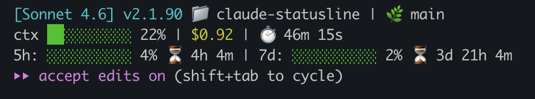

# Claude Code Statusline

A custom statusline script for [Claude Code](https://claude.ai/code) that shows model info, context usage, cost, rate limits, and git branch — all color-coded directly in your terminal.



---

## What It Shows

**Line 1 — Session info**
- Active model name (e.g. `claude-opus-4-6`)
- Current working directory
- Current git branch (if inside a git repo)

**Line 2 — Usage**
- Context window progress bar (green → yellow → red as it fills)
- Context used percentage
- Total session cost in USD
- Elapsed session time

**Line 3 — Rate limits** *(only shown when data is available)*
- 5-hour rate limit bar + percentage + time until reset
- 7-day rate limit bar + percentage + time until reset

---

## Install

### 1. Copy the script

```bash
curl -o ~/.claude/statusline-command.sh \
  https://raw.githubusercontent.com/AliT-Hammoud/claude-statusline/main/statusline-command.sh

chmod +x ~/.claude/statusline-command.sh
```

Or clone the repo and copy manually:

```bash
git clone https://github.com/AliT-Hammoud/claude-statusline.git
cp claude-statusline/statusline-command.sh ~/.claude/statusline-command.sh
chmod +x ~/.claude/statusline-command.sh
```

### 2. Update `~/.claude/settings.json`

Add or update the `statusLine` key:

```json
{
  "statusLine": {
    "type": "command",
    "command": "bash /Users/YOUR_USERNAME/.claude/statusline-command.sh"
  }
}
```

Replace `YOUR_USERNAME` with your macOS username (run `whoami` to check).

### 3. Restart Claude Code

The statusline will appear at the bottom of your Claude Code session.

---

## Requirements

- macOS (uses `date +%s` for countdown timers)
- `jq` installed — `brew install jq`
- Claude Code CLI

---

## Customization

The script uses standard ANSI colors. You can adjust thresholds in the `rate_color()` and context bar logic:

```bash
# Change warning threshold from 70% to 60%:
elif [ "$val" -ge 60 ]; then echo "$YELLOW"
```
